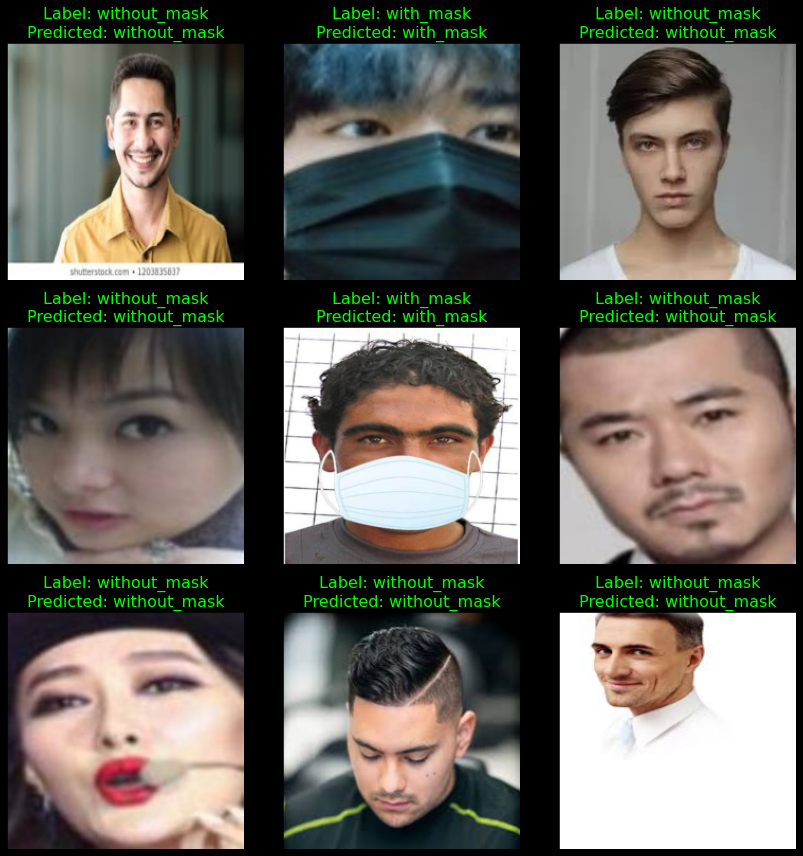
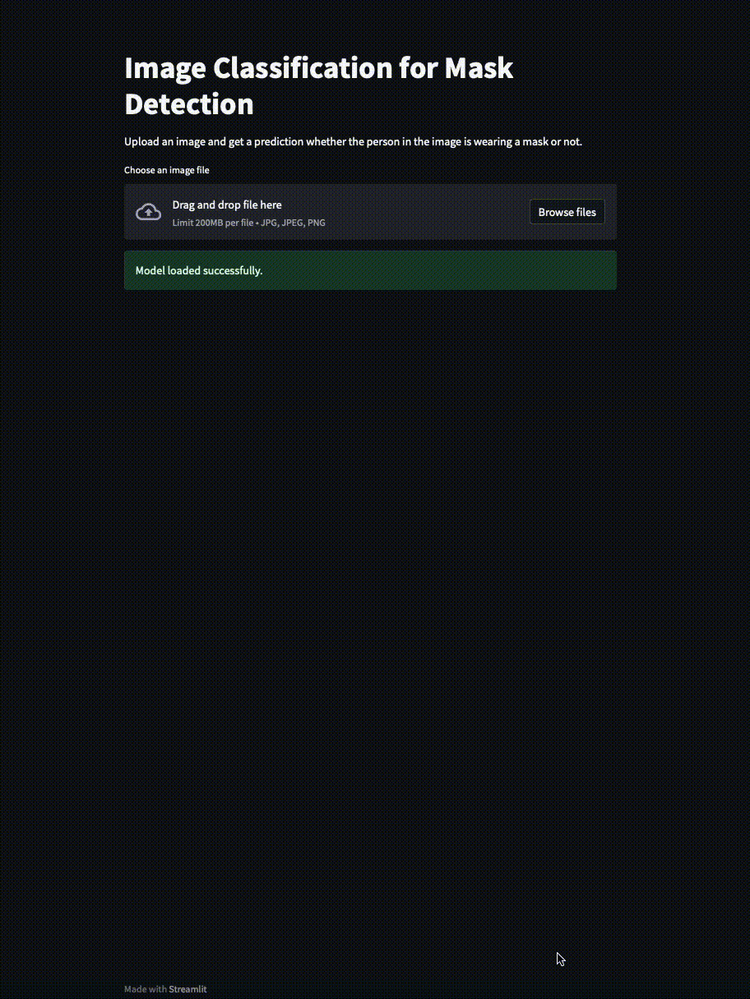

# Face Mask Detection Model
Face mask detection is a computer vision task that aims to identify whether a person in an image is wearing a mask or not. It is a challenging task, as masks can vary in appearance and may be partially obscured by other facial features.  
Face mask detection is an important task for a number of reasons. First, it can help to ensure compliance with mask-wearing mandates, which are in place in many places to help prevent the spread of COVID-19. Second, face mask detection can be used to identify people who may be at risk of spreading COVID-19, such as those who are not wearing masks or who are wearing masks incorrectly.

This repository contains a face mask detection model trained using PyTorch. The model was trained on the Face Mask 12K Images Dataset, and it achieves an accuracy of over 99% on the test set.
The model can be used in a variety of ways. For example, it could be used to develop a mobile app that allows users to check whether they are wearing their masks correctly. It could also be used to develop a system that monitors public spaces for people who are not wearing masks.

This repository contains a face mask detection model trained using PyTorch. The model was trained on the Face Mask 12K Images Dataset: `https://www.kaggle.com/datasets/ashishjangra27/face-mask-12k-images-dataset`.

## Example


## Requirements
- Python 3.6 or higher
- PyTorch 1.7 or higher
- TorchVision 0.9 or higher

## Usage
To use the model, simply clone this repository and install the requirements:
```
git clone https://github.com/bard/face-mask-detection.git
cd face-mask-detection
pip install -r requirements.txt
git lfs fetch
```
As the model is quite large, LFS is used to track this file. In case fetch did not properly download the full file, download the model from Github directly.
Once the requirements are installed, you can load the model and make predictions as follows:

```
import torch
from torchvision import transforms

# Load the model
model = torch.jit.load('model/mask_detection_model.pt')

# Preprocess the image
transform = transforms.Compose([transforms.Resize([224, 224]), transforms.ToTensor()])
image = transform(Image.open('image.jpg'))

# Make a prediction
with torch.no_grad():
    output = model(image.unsqueeze(0))
    _, prediction = torch.max(output.data, 1)

# Print the prediction
if prediction == 0:
    print('No mask')
else:
    print('Mask')
```

## Docker
To build a Docker image for the model, run the following command:


```
docker build -t face-mask-detection .
```

To run the Docker image, mount the directory containing your images to the `/images` directory in the container and run the following command:

```
docker run -it --rm \
    -v /path/to/images:/images \
    face-mask-detection
```
The model will then predict the presence of a mask in each image in the `/images` directory and save the results to the` /output` directory in the container.

## Streamlit App
The Streamlit app allows you to upload an image and get a prediction whether the person in the image is wearing a mask or not.

To run the Streamlit app, run the following command:

```
docker-compose up -d
```
As this loads in the entire model as well, it will require some time (total size of the container ~ 3 GB), so please be patient. Then open a web browser and navigate to `http://localhost:8501`.



## Additional Information
The Docker Compose file sets up a two-container environment, with one container for the PyTorch model and the other container for the Streamlit app. The containers are configured to prioritize the GPU, but will also work on a CPU-only machine.

The Streamlit app uses the st.cache_resource decorator to cache the loaded model. This means that the model will only be loaded once, even if the user uploads multiple images.

The Streamlit app also uses a spinner to indicate that the model is being loaded. This is because the model can take some time to load, especially if you are using a CPU-only machine.

Once the model is loaded, the Streamlit app will allow the user to upload an image and get a prediction. The prediction will be displayed on the page, below the uploaded image.

## Contributing
Contributions to this repository are welcome. If you find a bug or have a suggestion for improvement, please feel free to create an issue. If you would like to contribute code, please follow these steps:

- Fork the repository.
- Create a new branch for your changes.
- Make your changes and commit them to your branch.
- Push your branch to GitHub.
- Create a pull request.
I will review your pull request and merge it if it is approved.

Here are some specific ways that you can contribute:

- **Fix bugs.** If you find a bug in the model or the code, please create an issue to report it. You can also try to fix the bug yourself and create a pull request with your fix.
- **Improve the documentation.** If you find any errors or omissions in the documentation, please create an issue to report them. You can also add new documentation to explain new features or to provide more detailed instructions.
- **Add new features.** If you have an idea for a new feature, please create an issue to discuss it. If your idea is approved, you can implement the feature and create a pull request with your implementation.

I appreciate your contributions to this repository!

## License
This repository is licensed under the **MIT License**.